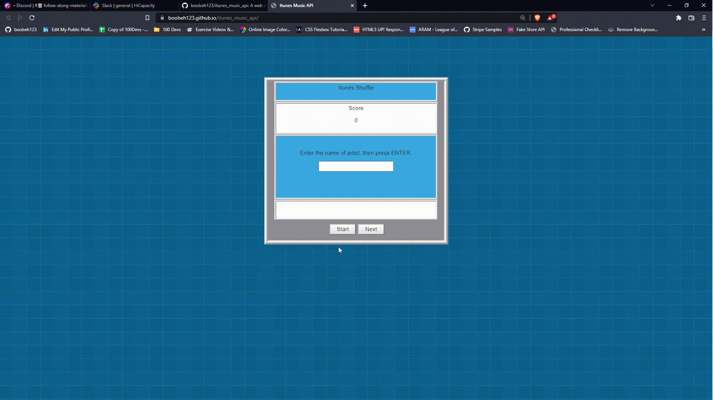

[original_itunes_music_api_digitalartcrew](https://github.com/digitalartcrew/itunes_music_api)

## Description
A web application that grabs the preview url of a song from the iTunes Music API. Guessing the artist name correctly will give you a score! 
This project originally uses jquery for its functionality. I am attempting to update the functionality to use ES6 JavaScript.

## Demo

## Features
* Fetches from the iTunes Music API.
* Plays the preview version of the fetched song.
* Guessing the artist name correctly tallys up a point.

## Technologies

## Optimizations
* Update the "Grab Next Song" function.
* Keep track of points by storing into localStorage.